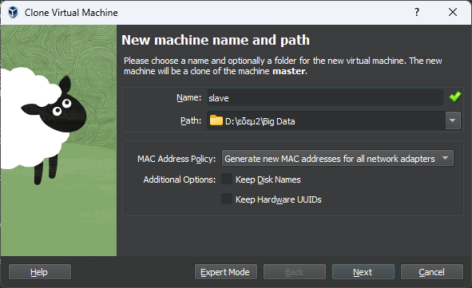

# Large Scale Data Management Systems

- [Large Scale Data Management Systems](#large-scale-data-management-systems)
  - [Setting up our working environment](#setting-up-our-working-environment)
    - [Creating the Virtual Machines (VMs)](#creating-the-virtual-machines-vms)
    - [Configuring SSH](#configuring-ssh)
    - [Installing all the necessary software](#installing-all-the-necessary-software)
    - [Starting the required services](#starting-the-required-services)
    - [Submitting a Python job](#submitting-a-python-job)
    - [Setting up the history server](#setting-up-the-history-server)
  - [Project](#project)
    - [Downloading the necessary data sets](#downloading-the-necessary-data-sets)
    - [Preprocessing the main dataset](#preprocessing-the-main-dataset)
    - [Query 1](#query-1)
    - [Query 4](#query-4)
      - [RDD](#rdd)

In this project, we are tasked with analyzing large datasets using Apache Hadoop (version 3.0 or higher) and Apache Spark (version 3.4 or higher) as primary tools. We set up and configure the necessary working environment and utilize virtual machines. The main objectives of this project are:

- To become proficient in installing and managing the distributed systems Apache Spark and Apache Hadoop.
- To apply modern techniques through Spark’s APIs for analyzing large volumes of data.
- To understand the capabilities and limitations of these tools in relation to the available resources and the configurations I choose.

> [!NOTE]
> Useful Links:
> - [`Hadoop Web UI`](http://master:9870/dfshealth.html)
> - [`Spark Web UI`](http://master:8080/)
> - [`Spark (Master) Worker Web UI`](http://master:8081/)
> - [`Spark (Slave) Worker Web UI`](http://slave:8081/)
> - [`History Server Web UI`](http://master:18080/)
>
> Make sure to update your system's `/etc/hosts` file to correctly resolve the hostnames `master` and `slave` to the respective IP addresses!

The main dataset for this project is sourced from the [City of Los Angeles' public data repository](https://data.lacity.org/). It contains crime data recorded in Los Angeles from 2010 to the present. You can download the data in .csv format from the following links:

- [Crime Data from 2010 to 2019](https://data.lacity.org/api/views/63jg-8b9z/rows.csv?accessType=DOWNLOAD)
- [Crime Data from 2020 to Present](https://data.lacity.org/api/views/2nrs-mtv8/rows.csv?accessType=DOWNLOAD)

Additionally, the links below provide descriptions for each of the 28 fields in the dataset, which will be helpful for the project. You can also find related or explanatory datasets in the “Attachments” section.

- [Crime Data Field Descriptions (2010-2019)](https://data.lacity.org/Public-Safety/Crime-Data-from-2010-to-2019/63jg-8b9z)
- [Crime Data Field Descriptions (2020-Present)](https://data.lacity.org/Public-Safety/Crime-Data-from-2020-to-Present/2nrs-mtv8)

In addition to the primary dataset, a series of smaller, publicly available datasets will also be used:

**LA Police Stations:** This dataset contains the locations of the 21 police stations in the city of Los Angeles. It is sourced from the city's public data repository and is available in .csv file format [here](https://geohub.lacity.org/datasets/lahub::lapd-police-stations/explore).

> [!WARNING]
> Due to a change in the coordinate system of the source provided for the LA Police Stations dataset, it is not possible to process it using the geopy library as suggested.Therefore, we will be using the data in [`la_police_stations.csv`](./data/la_police_stations.csv).

**Median Household Income by Zip Code (Los Angeles County):** This smaller dataset includes information on the median household income for areas within Los Angeles County, broken down by ZIP Code. The data is based on census results from 2015, 2017, 2019, and 2021, provided by the Los Angeles Almanac. For this project, only the 2015 data will be needed which is available in .csv file format [here](http://www.dblab.ece.ntua.gr/files/classes/data.tar.gz).

**Reverse Geocoding:** Geocoding refers to translating an address into a location in a coordinate system, while reverse geocoding is the process of converting coordinates (latitude, longitude) back into an address. For this project, reverse geocoding will be necessary to map coordinates to ZIP Codes within Los Angeles. This can be done programmatically using web services known as geocoders and libraries like [`geopy`](https://geopy.readthedocs.io/en/stable/##module-geopy.geocoders). Since this process can be slow due to web service latency, a dataset covering the needed locations has been provided. The dataset is available in .csv file forma [here](http://www.dblab.ece.ntua.gr/files/classes/data.tar.gz).

## Setting up our cluster

### Creating the Virtual Machines (VMs)

We will be creating 2 VMs using [`Virtual Box`](https://www.virtualbox.org/wiki/Downloads) and a [pre-cooked Ubuntu Server installation](https://sourceforge.net/projects/osboxes/files/v/vb/59-U-u-svr/22.04/64bit.7z/download). The first VM is going to serve as the master node and the second one as the slave node. Both machines will have the following specifications:

1. OS: Ubuntu 22.04 Jammy Jellyfish LTS
2. CPU: 2 cores
3. RAM: 4 GB


Make sure to change the corresponding network adapter to Bridged Adapter instead of the default NAT:


Having create the master VM we will now clone it to be used as the slave VM.




Afterwards start both machines in `Headless` mode do that they run on the background. Log in to each one and run the following commands to setup their respective hostname (Make sure to use *"slave"* instead for the slave VM):

```shell
sudo su –
hostname master
echo “master” > /etc/hostname
rm -f /etc/machine-id
dbus-uuidgen --ensure=/etc/machine-id
init 6
```

> [!NOTE]
> The default credentials of both VMs are:
> **Username**: osboxes
> **Password**: osboxes.org

> [!TIP]
> It is also strongly suggested that you upgrade your system by running `sudo apt update && sudo apt upgrade -y`.

### Configuring SSH

First, let's set up name-based resolution for the machines. To this end we need to know the IPv4 addresses of both VMs so, we run `ip a` on both machines and get the following information:

- Master IPv4: 192.168.1.39
- Slave IPv4: 192.168.1.150


We now edit `/etc/hosts` using `nano` on each VM **as well as the host machine** adding the following 2 lines at the bottom of the file

```shell
192.168.1.39 master
192.168.1.150 slave
```

> [!WARNING]
> After restarting your work station it is possible that the VMs might have been assigned new IPv4 addresses. As a result, we should edit `/etc/hosts` in both VMs to reflect that.

At last, we set up passwordless SSH which allows you to connect to another computer without typing your password each time. This is done by generating a pair of public and private keys. To achieve this, we use a set of pre-packaged scripts which you can download and extract as follows

```shell
wget http://www.cslab.ece.ntua.gr/~ikons/bigdata/samples_osboxes.tar.gz
tar -xzf samples_osboxes.tar.gz
```

Run the following script to set up passwordless SSH

```shell
~/scripts/set_passwordless_ssh.sh # The slave password will be required
```

> [!TIP]
> Copy the scripts to the slave as well, as they will be required in the following sections (`scp -r ~/scripts $USER@slave:.`).

### Installing all the necessary software

First of, we install Java 8

```shell
sudo ~/scripts/install_java.sh
```

Afterwards we install HDFS. To achieve this, we run the following but only on the master node

```shell
sudo ~/scripts/install_hadoop.sh
```

Installing Spark, requires us running the following code explicitly on the master node and then refreshing the environment on the slave as such:

```shell
~/scripts/install_spark.sh
source ~/.bashrc                  # to store some parameters on session
ssh slave
source ~/.bashrc
exit                              # back to master
```

### Starting the required services

First of, we need to format the namenode on the master VM. To do so, run

```shell
hdfs namenode -format
```

> [!IMPORTANT]
> We do this only the first time we start the HDFS.

Next to start the HDFS Namenode and Datanodes we execute the `start-dfs.sh` script. We should now be able to access the Hadoop Web UI at [`master:9870`](http://master:9870/dfshealth.html).


Finally, we have to start spark on both master and slave VM using `start-all.sh`

> [!TIP]
> The Spark logs can be found at `$SPARK_HOME/logs`

Using the `jps` command we can check that everything is up and running like so

```shell
> osboxes@master:~$ jps
1904 DataNode
1766 NameNode
2391 Worker
2263 Master
2126 SecondaryNameNode
2446 Jps
> osboxes@slave:~$ jps
1920 Worker
1974 Jps
1787 DataNode
```

You can now access the Spark Web UI at [`master:8080`](http://master:8080/). The Web UI for the Spark Worker running in the Master Node VM can be accessed at [`master:8081`](http://master:8081/) while the one running in the Slave Node VM can be accessed at [`slave:8081`](http://slave:8081/).


> [!NOTE]
> If you restart the host machine you must also restart `HDFS` as well as `Spark`.

### Submitting a Python job

First of all we must install Python 3.8 (on both master and slave) as follows (based on the post by [`TecAdmin`](https://tecadmin.net/install-python-3-8-ubuntu/)).

```shell
sudo apt-get install build-essential checkinstall
sudo apt-get install libncursesw5-dev libssl-dev \
    libsqlite3-dev tk-dev libgdbm-dev libc6-dev libbz2-dev libffi-dev zlib1g-dev
cd /opt
sudo wget https://www.python.org/ftp/python/3.8.12/Python-3.8.12.tgz
sudo tar xzf Python-3.8.12.tgz
cd Python-3.8.12
sudo ./configure --enable-optimizations
sudo make altinstall
```

> [!TIP]
> Check that Python3.8 has been correctly installed by running `python3.8 -V`. If so feel free to remove the corresponding *.tgz* file (`sudo rm -f /opt/Python-3.8.12.tgz`).

We also need to modify the *~/.bashrc* file for both master and slave. More specifically, we must alter the environment variable `PYSPARK_PYTHON` (`export PYSPARK_PYTHON=python3.8`). Afterwards run `source ~/.bashrc`.

We can now run `spark-submit $SPARK_HOME/examples/src/main/python/pi.py` to compute pi.

### Setting up the history server

History server is a helpful tool spark offers to inspect jobs after the execution has finished. To do that spark-history server needs to know where the log files generated for every application are stored. First of all, we create the `spark-events` directory as follows:

```shell
cd /tmp
mkdir spark-events
sudo chmod 777 spark-events
```

Then we must edit `$SPARK_HOME/conf/spark-defaults.conf` on both the master and slave VM and add the following lines at the end of it

```shell
spark.eventLog.enabled        true
spark.eventLog.dir            file:///tmp/spark-events
```

Finally, to start the history server just run `$SPARK_HOME/sbin/start-history-server.sh`. You should now be able to check out the History Server Web UI at [`master:18080`](http://master:18080/)


## Project

### Downloading the necessary data sets

We first create a directory to store all the data by running `hadoop fs -mkdir -p /user/$USER`. Let's now download the data as follows:

```shell
# Download the main dataset
mkdir -p ~/data/crime_data
cd ~/data/crime_data
wget https://data.lacity.org/api/views/63jg-8b9z/rows.csv?accessType=DOWNLOAD && mv rows.csv\?accessType\=DOWNLOAD crime_data_2010_2019.csv
wget https://data.lacity.org/api/views/2nrs-mtv8/rows.csv?accessType=DOWNLOAD && mv rows.csv\?accessType\=DOWNLOAD.1 crime_data_2020_present.csv

# Download the secondary datasets
cd ../
wget http://www.dblab.ece.ntua.gr/files/classes/data.tar.gz && tar -xzf data.tar.gz
```

and organize it in the following folder structure

```shell
tree ~/data/
/home/osboxes/data/
├── crime_data
│   ├── crime_data_2010_2019.csv
│   └── crime_data_2020_present.csv
├── income
│   ├── LA_income_2015.csv
│   ├── LA_income_2017.csv
│   ├── LA_income_2019.csv
│   └── LA_income_2021.csv
├── la_police_stations.csv
└── revgecoding.csv

2 directories, 8 files
```

We now need to create a directory for storing our data in HDFS and move the data directory in its entirety there. This can be achieved as such

```shell
hadoop fs -mkdir -p /user/$USER
hadoop fs -put ~/data/ /user/$USER
hadoop fs -ls /user/$USER/data
Found 4 items
drwxr-xr-x   - osboxes supergroup          0 2024-06-04 07:50 /user/osboxes/data/crime_data
drwxr-xr-x   - osboxes supergroup          0 2024-06-04 07:50 /user/osboxes/data/income
-rw-r--r--   2 osboxes supergroup       1386 2024-06-04 07:50 /user/osboxes/data/la_police_stations.csv
-rw-r--r--   2 osboxes supergroup     897062 2024-06-04 07:50 /user/osboxes/data/revgecoding.csv
```

### Preprocessing the main dataset

We convert the main dataset into parquet file. Parquet, an open-source columnar file format, excels at storing and retrieving large datasets efficiently. It achieves this through features like columnar storage for faster querying, compression for reduced file size, and rich metadata for streamlined data processing. This makes Parquet a popular choice for big data analytics, offering advantages in performance, storage efficiency, and data portability.

[`csv_to_parquet.py`](./src/csv_to_parquet.py) merges the two csv files and stores them as a single csv as well as a single parquet file.

> [!NOTE]
> We additionally merge all LA Income data and store them as a single csv as well as a single parquet file.

```shell
spark-submit\
  --deploy-mode client \
  --driver-memory 1g \
  --executor-memory 1g \
  --num-executors 2 \
  --executor-cores 2 \
  ~/src/csv_to_parquet.py
```


> [!TIP]
> To make it easier to work with the `src` folder, it is recommended to mount it onto the master VM. This can be done by following these steps:
> 1. Open the settings of the master VM in VirtualBox.
> 2. Go to the "Shared Folders" tab.
> 3. Click the "Add" button and add the `src` folder.
> 4. Start the master VM.
> 5. Open a terminal on the master VM and run the following command to mount the shared folder:
>
> 
> Finally mount run the following command on master to mount the shared folder:
>
> ```shell
> sudo mount -t vboxsf src ~/src
> ```

### Query 1

First of all we want to find, for each year, the 3 months with the highest number of recorded crimes. The output should display the specific months for each year, the total number of incidents, and the rank of each month within that year. The results should be presented in ascending order by year and in descending order by the number of records.

We implement two different query strategies: one using the [`DataFrame`](https://spark.apache.org/docs/latest/api/python/reference/pyspark.sql/api/pyspark.sql.DataFrame) API and the other using the [`SQL`](https://spark.apache.org/docs/latest/api/python/reference/pyspark.sql/index.html) API.

Furthermore, we compare the performance by reading data from CSV files and then repeat the experiment using the parquet format for the data files.

| File Format | API       | Time to Read File (s) | Time to Execute Query (s) | Total Execution Time (s) |
| ----------- | --------- | --------------------- | ------------------------- | ------------------------ |
| CSV         | DataFrame | 19.025176             | 16.433017                 | 35.458518                |
| CSV         | SQL       | 18.820279             | 16.263681                 | 35.084088                |
| Parquet     | DataFrame | 8.129294              | 15.227777                 | 23.357188                |
| Parquet     | SQL       | 8.126157              | 16.708556                 | 24.835045                |

The results clearly demonstrate that Parquet files consistently outperform CSV files in terms of file read time, resulting in quicker overall execution times regardless of the chosen API.

Moreover, for CSV files, the SQL API slightly outperforms the DataFrame API in both read and query execution times. Conversely, for Parquet files, the DataFrame API notably surpasses the SQL API in query execution time.

Parquet files are designed for efficient data retrieval, which naturally leads to better read times.

> [!NOTE]
> The truncated output of [`Query 1`](./src/query_1.py) is shown below
>
> | Year | Month | CrimeCount | Rank |
> | ---- | ----- | ---------- | ---- |
> | 2010 | 1     | 19520      | 1    |
> | 2010 | 3     | 18131      | 2    |
> | 2010 | 7     | 17857      | 3    |
> | 2011 | 1     | 18141      | 1    |
> | 2011 | 7     | 17283      | 2    |
> | 2011 | 10    | 17034      | 3    |
> | 2012 | 1     | 17954      | 1    |
> | 2012 | 8     | 17661      | 2    |
> | 2012 | 5     | 17502      | 3    |


### Query 4

#### RDD

Let's now calculate the number of crimes involving the use of any type of firearms per police department, along with the average distance of each incident from the respective police department and display the results sorted by the number of incidents in descending order.

> [!NOTE]
>
> 1. Incidents involving the use of firearms of any type correspond to codes in the *"Weapon Used Cd"* column starting with *"1xx"*.
> 2. The codes in the *"AREA"* column of the Los Angeles Crime Data correspond to those in the *"PRECINCT"* column of the LA Police Stations and represent the police department responsible for each incident.
> 3. Some records (incorrectly) refer to *Null Island*. These should be filtered out of the dataset and not considered in the calculation, as they would negatively affect the results of our queries regarding distance.

We are going to be using [`geopy`](https://geopy.readthedocs.io/en/stable/) in order to calculate the distance of each incident from the respective police department. `geopy` makes it easy for Python developers to locate the coordinates of addresses, cities, countries, and landmarks across the globe using third-party geocoders and other data sources. The implementation of our distance function is shown below:

```python
from geopy.distance import geodesic


def distance(lat1: float, lon1: float, lat2: float, lon2: float) -> float:
    """Calculate the distance in kilometers between two geographic points.

    Args:
        lat1 (float): Latitude of the first point.
        lon1 (float): Longitude of the first point.
        lat2 (float): Latitude of the second point.
        lon2 (float): Longitude of the second point.

    Returns:
        float: The distance in kilometers between the two points.
    """
    return geodesic((lat1, lon1), (lat2, lon2)).km
```

Installing the [`geopy`](https://geopy.readthedocs.io/en/stable/) library can be done as follows

```shell
python3.8 -m pip install geopy
```

> [!WARNING]
> Make sure to install `geopy` on both the master and the slave VM.

In the scope of this query, we're tasked with joining the Los Angeles Crime Data with the LA Police Stations dataset. To accomplish this, we're exploring two join algorithms using the RDD API: broadcast join and repartition join. Our approach is based on the article titled ["A Comparison of Join Algorithms for Log Processing in MapReduce"](https://dl.acm.org/doi/10.1145/1807167.1807273). Our implementation can be found at [`Query 4 (RDD)`](./src/query_4_rdd.py)

> [!NOTE]
> The output of [`Query 4 (RDD)`](./src/query_4_rdd.py) is shown below
>
> | Division         | Average Distance   | Incidents |
> | ---------------- | ------------------ | --------- |
> | 77TH STREET      | 2.689397917722902  | 17021     |
> | SOUTHEAST        | 2.1059356553935613 | 12948     |
> | NEWTON           | 2.017146438261081  | 9844      |
> | SOUTHWEST        | 2.70213487271351   | 8912      |
> | HOLLENBECK       | 2.6493492384728072 | 6202      |
> | HARBOR           | 4.075218849177927  | 5622      |
> | RAMPART          | 1.5750000978486272 | 5116      |
> | MISSION          | 4.708165065228117  | 4503      |
> | OLYMPIC          | 1.8206840904852268 | 4424      |
> | NORTHEAST        | 3.9071086179159047 | 3920      |
> | FOOTHILL         | 3.802395356836228  | 3775      |
> | HOLLYWOOD        | 1.461304536392908  | 3643      |
> | CENTRAL          | 1.13827946302102   | 3615      |
> | WILSHIRE         | 2.3129170711246134 | 3525      |
> | NORTH HOLLYWOOD  | 2.7168572127038564 | 3465      |
> | WEST VALLEY      | 3.5314566358879294 | 2903      |
> | VAN NUYS         | 2.2198640197215305 | 2733      |
> | PACIFIC          | 3.7293185318450446 | 2709      |
> | DEVONSHIRE       | 4.012031581736769  | 2472      |
> | TOPANGA          | 3.482110128843622  | 2285      |
> | WEST LOS ANGELES | 4.248587515715775  | 1541      |

- **Repartition Join**: This approach resembles a partitioned sort-merge join seen in parallel RDBMS systems and is available in the Hadoop ecosystem's join package. Implemented within a single MapReduce job, the standard repartition join involves mapping tasks tagging records with their originating table and join key, followed by partitioning, sorting, and merging by the framework. Records with the same join key are grouped and processed by reducers, which perform a cross-product between records from both tables. However, this approach faces challenges when dealing with small key cardinality or skewed data, as it may require buffering all records for a given join key, posing potential memory constraints. Variants of the standard repartition join are utilized in tools like Pig, Hive, and Jaql, albeit they may encounter similar buffering issues, particularly with larger tables.
- **Broadcast Join**: Particularly useful when dealing with a reference table (R) that is much smaller than the log table (L). Instead of moving both tables across the network as in repartition-based joins, broadcast join broadcasts the smaller table (R) to all nodes, avoiding the network overhead associated with moving the larger table (L). Broadcast join is executed as a map-only job, where each map task retrieves all of R from the distributed file system (DFS) and uses a main-memory hash table to join a split of L with R. The algorithm dynamically decides whether to build the hash table on L or R, depending on which is smaller. If R is smaller, all partitions of R are loaded into memory to build the hash table. If the split of L is smaller, the map function partitions L and joins the corresponding partitions of R and L.

To sum up, broadcast join typically outperforms repartition join when the reference table (R) is significantly smaller than the log table (L). In broadcast join, the smaller table (R) is sent to all nodes, eliminating the need to transfer the larger table (L) multiple times across the network. This method also accelerates data processing by utilizing main-memory hash tables. Conversely, repartition join redistributes both tables across the network, which may lead to slower processing, particularly with larger datasets.

Surprisingly in our case, broadcast join took 42.436191 seconds, while repartition join took 40.830534 seconds. The difference in execution times indicates that factors like dataset size, network conditions, or how the cluster is set up might affect how well each join works.
